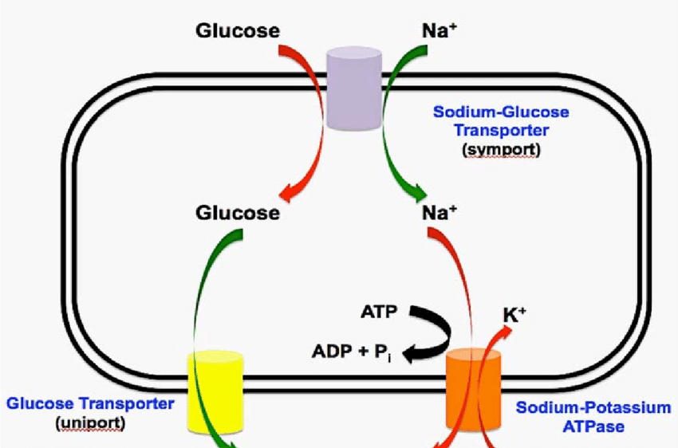

# mCNN-Glucose
## Introduction
Glucose transporters enable the passive transport of glucose across cell membranes, moving it down its concentration gradient. This process does not require energy (ATP) but relies on the concentration gradient of glucose. They help regulate blood glucose levels by controlling the uptake of glucose from the bloodstream into various tissues, particularly muscle and adipose tissue. They ensure that cells, especially those in high-demand tissues like the brain, muscle, and liver, have a constant supply of glucose for energy production and metabolism.
## Methodology
In the present study we devised a method that utilized evolutionary information from Position-Specific Scoring matrics (PSSM) as the primary features and fed these features to multiple-scanning windows-based covolutional neural networks to derive valuable insight from the evolutionary profiles to effectively classify glucose transporters into three distinct families.

## Dataset
Table 1: Dataset used in the present study
| Classes  | Primary Data | Data with identity < 40% |train | test |
| ------------- | ------------- |------------- |------------- |------------- |
| GLUTs  | 9616  | 510 | 408 | 102|
| SGLTs  | 4107  | 225 | 180 | 45|
| SWEETs  | 2026  | 190 | 152 | 38|
| **Total**  | **15749** | **925** |**740** | **185** |

## Results
Table 2: Performance of mCNN-Glucose on the three glucose tranport proteins using an independent test set
| Classes  | Sensitivity | Specificity | Accuracy | MCC |
| ------------- | ------------- |------------- |------------- |------------- |
| GLUTs  | 99.02%   | 100.00%  | 99.46% | 0.99 |
| SGLTs  | 97.78%  | 100.00%  | 99.46% | 0.99 |
| SWEETs  | 100.00%  | 96.60% | 97.30%  | 0.92 |
## Conclusion
Our devised method achieved remarkable performance and outperformed the classical Machine Learning algorithms and a traiditional convolutional neural network. Our proposed method secured a matthews correlation coeifficient (MCC) of 0.99, 0.99, and 0.92 fro GLUT, SGLT, and SWEET transporters, respectively.

